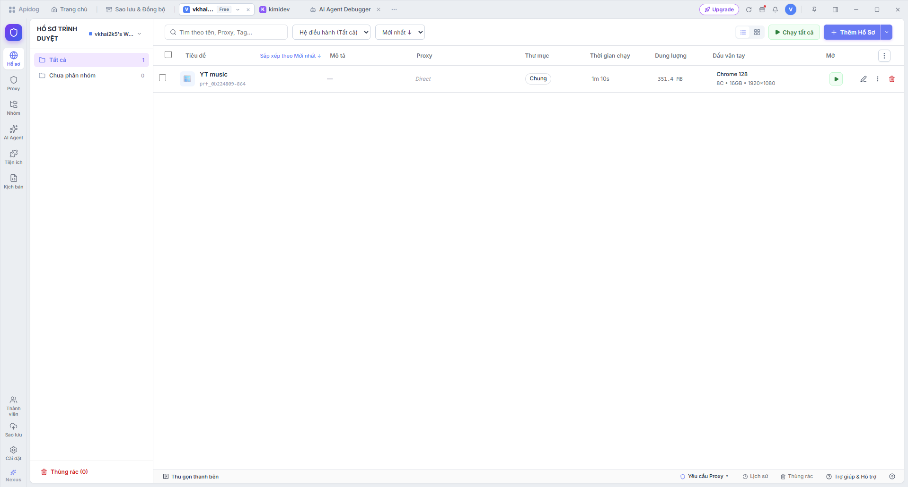
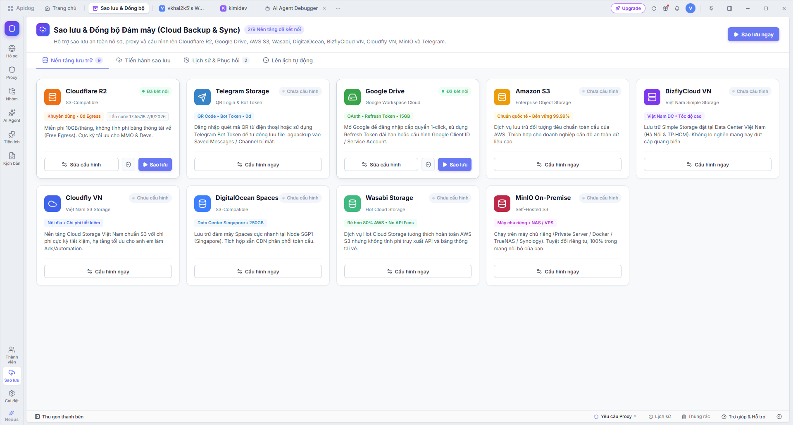
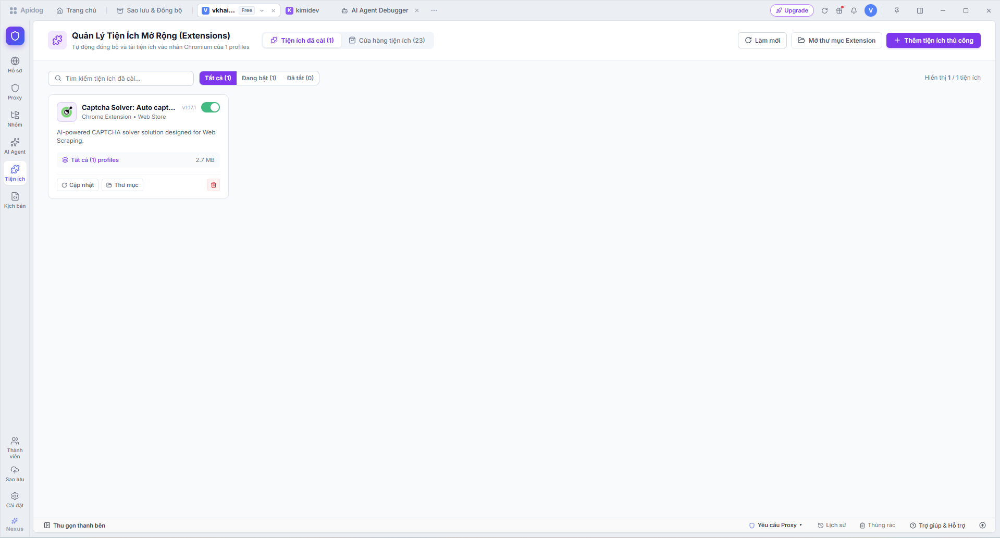

# 🌐 Antidetect Browser (Multi-Profile & Fingerprint Protection)

<p align="center">
  
</p>

<p align="center">
  <b>Hệ thống trình duyệt Antidetect đa hồ sơ chuyên nghiệp, bảo vệ dấu vân tay số (Digital Fingerprint), quản lý Proxy chuyên sâu, tích hợp kho tiện ích mở rộng và đồng bộ đám mây đa nền tảng.</b>
</p>

<p align="center">
  
  
  
  
  
  
</p>

---

## 📑 Mục Lục
1. [Giới Thiệu Dự Án](#-giới-thiệu-dự-án)
2. [Tính Năng Cốt Lõi](#-tính-năng-cốt-lõi)
   - [1. Quản Lý Hồ Sơ & Bảo Vệ Vân Tay Số](#1-quản-lý-hồ-sơ--bảo-vệ-vân-tay-số)
   - [2. Quản Lý Kho Proxy Đa Giao Thức](#2-quản-lý-kho-proxy-đa-giao-thức)
   - [3. Quản Lý Tiện Ích Mở Rộng (Extensions)](#3-quản-lý-tiện-ích-mở-rộng-extensions)
   - [4. Sao Lưu & Đồng Bộ Đám Mây (Cloud Backup)](#4-sao-lưu--đồng-bộ-đám-mây-cloud-backup)
   - [5. Tự Động Hóa & AI Agent Debugger](#5-tự-động-hóa--ai-agent-debugger)
3. [Ảnh Chụp Giao Diện Ứng Dụng](#-ảnh-chụp-giao-diện-ứng-dụng)
4. [Cấu Trúc Thư Mục Dự Án](#-cấu-trúc-thư-mục-dự-án)
5. [Cài Đặt & Hướng Dẫn Phát Triển](#-cài-đặt--hướng-dẫn-phát-triển)
   - [Yêu cầu tiên quyết](#yêu-cầu-tiên-quyết)
   - [Khởi chạy môi trường Dev](#khởi-chạy-môi-trường-dev)
   - [Đóng gói bộ cài đặt Windows (.exe)](#đóng-gói-bộ-cài-đặt-windows-exe)
6. [Công Nghệ Sử Dụng](#-công-nghệ-sử-dụng)

---

## 💡 Giới Thiệu Dự Án

**Antidetect Browser** là giải pháp phần mềm máy tính (Desktop Application) được xây dựng trên nền tảng **Electron** kết hợp với giao diện hiện đại bằng **React 19** và **Vite**. 

Ứng dụng phục vụ cho các nhà phát triển, chuyên gia Marketing, quản lý tài khoản thương mại điện tử, mạng xã hội và MMO với nhu cầu:
- Duyệt web hoàn toàn ẩn danh, cô lập môi trường của từng tài khoản.
- Tùy biến các tham số phần cứng và trình duyệt (Canvas, WebGL, AudioContext, WebRTC, User-Agent, Fonts, Màn hình, CPU/RAM).
- Kết nối và kiểm tra chất lượng hàng ngàn Proxy (IPv4 / IPv6, SOCKS5, HTTP/HTTPS).
- Sao lưu toàn bộ hồ sơ trực tiếp lên hạ tầng đám mây (Cloudflare R2, Google Drive, AWS S3, Telegram Bot Storage,...).

---

## 🚀 Tính Năng Cốt Lõi

### 1. Quản Lý Hồ Sơ & Bảo Vệ Vân Tay Số
* **Môi trường cách ly tuyệt đối:** Mỗi profile hoạt động trong một thư mục người dùng (`userDataDir`) riêng biệt; cookie, cache, localStorage, IndexedDB và phiên duyệt web độc lập 100%.
* **Giả lập thông số phần cứng (Fingerprint Spoofing):**
  * Canvas Fingerprint Noise (chống Canvas Hash Tracking).
  * WebGL Vendor & Renderer (giả lập card đồ họa NVIDIA GeForce, AMD Radeon, Intel Iris).
  * WebRTC Spoofing (bảo vệ IP thực, tránh lộ IP qua WebRTC leak).
  * AudioContext Buffer Noise.
  * Tùy chỉnh CPU Cores, RAM, Độ phân giải màn hình, Ngôn ngữ, Múi giờ theo IP Proxy.
* **Tùy biến khởi động:** Chọn công cụ tìm kiếm mặc định (Google, Bing, DuckDuckGo, Yahoo, Yandex, Baidu, Brave) và URL khởi chạy tự động.
* **Thao tác hàng loạt (Batch Operations):** Chạy hàng loạt (Batch Launch), Dừng hàng loạt (Batch Stop), Di chuyển nhóm, Gán proxy, Xóa / Phục hồi từ Thùng rác.
* **Giao diện đa góc nhìn:** Hỗ trợ xem dạng Bảng (Table view) và dạng Thẻ (Grid view) với tính năng chuột kéo quét chọn vùng (Drag-to-select) mượt mà.

### 2. Quản Lý Kho Proxy Đa Giao Thức
* **Hỗ trợ đa giao thức:** `SOCKS5`, `HTTP`, `HTTPS`, `SOCKS4`.
* **Hỗ trợ phân loại IP:** Lựa chọn `IPv4` hoặc `IPv6` (hỗ trợ chuẩn địa chỉ ngoặc vuông `[2402:...]:port`).
* **Kiểm tra kết nối thời gian thực (Live Ping Test):** Đo độ trễ (latency ms) và tự động nhận diện vị trí địa lý / quốc gia từ IP của proxy thông qua native TCP socket.
* **Nhập nhanh & Tự động nhận diện:**
  * **Nút "Dán proxy":** Tự động đọc Clipboard và phân tích mọi định dạng chuỗi: `host:port`, `host:port:user:pass`, `user:pass@host:port`, `socks5://...`.
  * **Nút "Chọn file":** Tải danh sách proxy từ file văn bản `.txt` hoặc `.csv`.
* **Đa dạng nguồn Proxy:**
  * Proxy tĩnh (Static Pool).
  * Proxy xoay qua API (Rotating Proxies).
  * Đổi IP qua thiết bị DCOM 4G/5G.
  * Sinh dải proxy IPv6 hàng loạt.

### 3. Quản Lý Tiện Ích Mở Rộng (Extensions)
* **Tự động đọc mã nguồn cục bộ:** Quét trực tiếp thư mục `extensions/`, tự động đọc tệp `manifest.json` để lấy Tên, Phiên bản, Icon và Mô tả.
* **Đồng bộ nhân Chromium:** Các tiện ích được kích hoạt sẽ tự động nạp vào nhân trình duyệt khi mở profile thông qua tham số `--load-extension`.
* **Cài đặt tiện ích thủ công:** Hỗ trợ nạp extension dạng thư mục nguồn giải nén hoặc đóng gói (.crx / .zip).
* **Gỡ bỏ an toàn & sạch sẽ:** Tự động xóa sạch mã nguồn thư mục tiện ích trên đĩa khi người dùng bấm gỡ bỏ.
* **Cửa hàng tiện ích tích hợp:** Cung cấp sẵn các tiện ích phổ biến (Captcha Solver, Cookie Editor, User-Agent Switcher,...).

### 4. Sao Lưu & Đồng Bộ Đám Mây (Cloud Backup)
* Hỗ trợ kết nối và đồng bộ dữ liệu hồ sơ lên **9 nền tảng lưu trữ đám mây**:
  1. **Cloudflare R2** *(Chuẩn S3-Compatible, miễn phí 10GB/tháng, 0đ phí băng thông tải về Egress)*.
  2. **Telegram Storage** *(Lưu trữ an toàn qua Telegram Bot Token vào kênh riêng tư hoặc Saved Messages)*.
  3. **Google Drive** *(Xác thực OAuth 1-click & Refresh Token dài hạn)*.
  4. **Amazon S3** *(Hạ tầng Enterprise toàn cầu)*.
  5. **BizflyCloud VN** & **Cloudfly VN** *(Hạ tầng lưu trữ S3 tốc độ cao đặt tại Datacenter Việt Nam)*.
  6. **DigitalOcean Spaces** *(Cụm máy chủ Singapore SGP1)*.
  7. **Wasabi Storage** *(Lưu trữ chi phí tối ưu)*.
  8. **MinIO On-Premise** *(Hệ thống lưu trữ Private Server / NAS / Docker nội bộ, bảo mật 100%)*.
* Đóng gói toàn bộ cấu hình, cookies và dữ liệu duyệt web thành tệp nén mã hóa `.agbackup`.
* Lên lịch sao lưu định kỳ tự động và khôi phục dữ liệu theo từng điểm mốc thời gian.

### 5. Tự Động Hóa & AI Agent Debugger
* Tích hợp công cụ gỡ lỗi kịch bản tự động hóa **Playwright / Puppeteer**.
* **MiniDock nổi:** Thanh điều khiển thu nhỏ nằm cố định góc màn hình giúp theo dõi trạng thái, chuyển đổi qua lại và tắt nhanh các hồ sơ đang mở.
* Hệ thống ghi nhật ký hoạt động (Activity Logs) và thông báo đẩy (Notification Popover).

---

## 📸 Ảnh Chụp Giao Diện Ứng Dụng

### Quản Lý Hồ Sơ Trình Duyệt (Profiles Manager)


### Sao Lưu & Đồng Bộ Đám Mây (Cloud Backup & Sync)


### Quản Lý Tiện Ích Mở Rộng (Extensions Manager)


---

## 📂 Cấu Trúc Thư Mục Dự Án

```plaintext
AntidetectBrowser/
├── electron/                   # Mã nguồn Electron Main Process
│   ├── main.cjs                # Điểm khởi chạy chính của Electron
│   ├── miniDock.cjs            # Cửa sổ MiniDock điều khiển nhanh
│   └── ipc/                    # Các bộ xử lý giao tiếp IPC (Profiles, Proxies, Extensions, Backup,...)
├── extensions/                 # Thư mục chứa mã nguồn các tiện ích mở rộng đã cài đặt
├── release/                    # Thư mục xuất bản file cài đặt Windows (.exe)
├── src/                        # Mã nguồn React Frontend
│   ├── components/             # Các component dùng chung (Modals, TitleBar, Skeleton, Dock,...)
│   ├── features/               # Các module tính năng chuyên sâu
│   │   ├── profiles/           # Quản lý hồ sơ, cấu hình vân tay, bảng danh sách
│   │   └── auth/               # Đăng nhập, phân quyền, workspace
│   ├── pages/                  # Các trang màn hình chính
│   │   ├── ProfilesPage.jsx    # Trang danh sách hồ sơ
│   │   ├── ProxiesPage.jsx     # Quản lý kho Proxy
│   │   ├── ExtensionsPage.jsx  # Quản lý tiện ích mở rộng
│   │   ├── BackupSyncPage.jsx  # Sao lưu & đồng bộ đám mây
│   │   ├── AutomationPage.jsx  # Tự động hóa kịch bản
│   │   └── AiAgentDebuggerPage.jsx # Trình gỡ lỗi AI Agent
│   ├── store/                  # Quản lý trạng thái ứng dụng (Context API, Hooks)
│   ├── styles/                 # CSS Design System & Theme
│   └── i18n/                   # Hỗ trợ đa ngôn ngữ (Tiếng Việt & English)
├── package.json                # Cấu hình dự án & Dependencies
├── vite.config.js              # Cấu hình Vite bundler
└── README.md                   # Tài liệu hướng dẫn sử dụng
```

---

## 🛠️ Cài Đặt & Hướng Dẫn Phát Triển

### Yêu cầu tiên quyết
- **Hệ điều hành:** Windows 10 hoặc Windows 11 (64-bit).
- **Node.js:** Phiên bản `>= 18.x` (Khuyên dùng Node 20 LTS).
- **Trình quản lý gói:** `npm` hoặc `yarn`.

### Các bước cài đặt

1. **Cài đặt thư viện phụ thuộc:**
   ```bash
   npm install
   ```

2. **Chạy ứng dụng trong môi trường phát triển (Dev Mode):**
   ```bash
   # Khởi chạy Vite Dev Server
   npm run dev
   ```
   *Mở thêm một terminal khác để khởi chạy Electron:*
   ```bash
   # Khởi chạy cửa sổ Electron Desktop App
   npm run app
   ```

3. **Kiểm tra cú pháp code (Linting):**
   ```bash
   npm run lint
   ```

4. **Biên dịch Frontend Web Bundle:**
   ```bash
   npm run build
   ```

### Đóng gói bộ cài đặt Windows (.exe)

Để tạo bộ cài đặt Windows chuẩn NSIS x64:
```bash
npm run build:exe
```
File cài đặt hoàn chỉnh sẽ được tạo tại thư mục `release/` với tên dạng:
`release/AntidetectBrowser-Setup-1.1.0.exe`

Bộ cài đặt NSIS hỗ trợ:
- Tùy chọn đường dẫn cài đặt phần mềm.
- Tự động tạo Shortcut trên Desktop và Start Menu.
- Tự động khởi chạy ứng dụng sau khi cài đặt hoàn tất.
- Trình gỡ cài đặt (Uninstaller) sạch sẽ.

---

## 💻 Công Nghệ Sử Dụng

| Thành phần | Công nghệ / Thư viện | Vai trò |
| :--- | :--- | :--- |
| **Desktop Runtime** | **Electron 44** | Cung cấp môi trường chạy ứng dụng máy tính và tương tác với hệ điều hành |
| **Giao diện người dùng** | **React 19** & **Vite 8** | Xây dựng giao diện Single Page Application hiện đại, tải siêu tốc với HMR |
| **Bộ Icon đồ họa** | **Lucide React** | Hệ thống icon tối giản, sắc nét và đồng bộ |
| **Kiểm tra mã nguồn** | **Oxlint** | Công cụ linter hiệu năng cao bằng Rust |
| **Đóng gói ứng dụng** | **Electron Builder** | Tạo bộ cài đặt Windows NSIS x64 |
| **Giao tiếp Socket** | **Node.js `net` & `tls`** | Kiểm tra kết nối TCP socket và đo ping proxy chuẩn xác |
| **Giao diện & Theme** | **CSS Variables & Custom Tokens** | Giao diện tối ưu theo phong cách Apidog hiện đại, tinh gọn |

---

## 📄 Bản Quyền & Giấy Phép

Dự án này được phát triển nội bộ cho mục đích quản lý và vận hành trình duyệt Antidetect. Mọi quyền được bảo lưu.